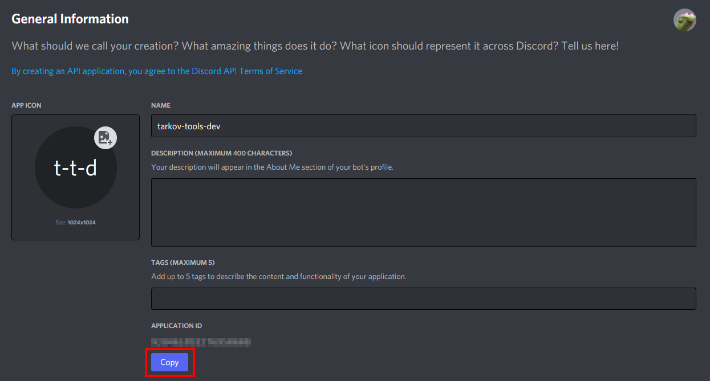

# Tarkov-Tools Discord bot 🤖

This is the official [tarkov-tools](https://tarkov-tools.com) discord bot.

To add it to your server, just click the link below:

[https://discord.com/api/oauth2/authorize?client_id=925298399371231242&permissions=309237664832&scope=bot%20applications.commands](https://discord.com/api/oauth2/authorize?client_id=925298399371231242&permissions=309237664832&scope=bot%20applications.commands)

or here:

[discordbotlist.com/bots/tarkov-tools](https://discordbotlist.com/bots/tarkov-tools)

or here
[top.gg/bot/925298399371231242](https://top.gg/bot/925298399371231242)

---

## Development 🔨

For development you need to crate 2 files in your local directory. One is for registering commands and one is for running the bot.

The files are:

- `config-dev.json`
- `.env`

### Create a Disord Bot

Before you can test the bot out locally, you will need to create a Discord bot to authenticate with.

Create your bot:


### The `config-dev.json` file

An example of the `config-dev.json` file can be found at the root of this repo at `config-dev.example.json`. You will need to edit and rename this file to `config-dev.json` and add the appropriate values as seen below:

```json
{
    "clientId": "<add_value_here>",
    "guildId": "<add_value_here>",
    "token": "<add_value_here>"
}
```

#### clientId

The `clientId` can be found in your Discord bot's general information under `APPLICATION_ID` [https://discord.com/developers/applications/](https://discord.com/developers/applications/)



#### guildId

Copy the `guildId` from the Discord server you want to add the bot to:


> Note: In order to copy a guild id, you will need to have Discord developer mode enabled, scroll down in the guide to see how to do so (its easy!)

#### token

The token is the same as the `DISCORD_API_TOKEN` which can be found in the `.env` setup steps below.

### The `.env` file

Next, you will need to edit the `.env` file and add the appropriate values as seen below:

```ini
DISCORD_API_TOKEN=<value_here>
ADMIN_ID=<value_here>
```

The `DISCORD_API_TOKEN` can be found here:


`ADMIN_ID` is your personal Discord user ID, which is used for admin commands and can be found here:


To add the DEV bot to your server, click this link where you've replaced the `<MY_CLIENT_ID>` with your bots application id:

[https://discord.com/api/oauth2/authorize?client_id=<MY_CLIENT_ID>&permissions=274877910080&scope=bot%20applications.commands](https://discord.com/api/oauth2/authorize?client_id=MY_CLIENT_ID&permissions=274877910080&scope=bot%20applications.commands)

### How to Enable Developer Mode

In order to copy certain values (such as channel/guild/user IDs) you need to enable developer mode in the Discord client

1. In Discord, open your User Settings by clicking the Settings Cog next to your user name on the bottom.
2. Go to Appearance and enable Developer Mode under the Advanced section, then close User Settings.
3. Open your Discord server, right-click on the server name, then select Copy ID (to obtain the "guild ID" of your Discord server)

---

### Starting the Bot 🚀

Before you start the bot you will need to register the Slash commands in your test server:

```console
$ node deploy-commands-dev.mjs
Successfully registered application commands.
```

Next, there are two ways to start the bot:

- Locally (suggested)
- Docker

#### Locally

To start the bot locally, run the following commands:

```console
$ export DISCORD_API_TOKEN=<token>
$ export NODE_ENV=development
$ node index.mjs
Filling autocomplete cache
fill-autocomplete-cache: 590.582ms
Logged in as tarkov-tools-dev#1234!
```

#### Docker

To start the bot with Docker, simply run the following command:

```console
$ docker-compose up --build
Creating bot ... done
Attaching to bot
bot    | Setting up rollbar
bot    | Filling autocomplete cache
bot    | fill-autocomplete-cache: 944.249ms
bot    | Logged in as tarkov-tools-dev#1234!
```